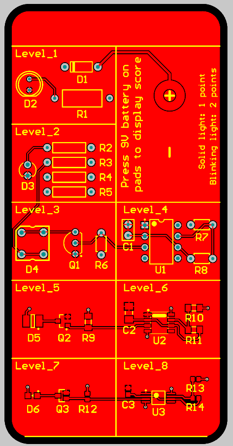
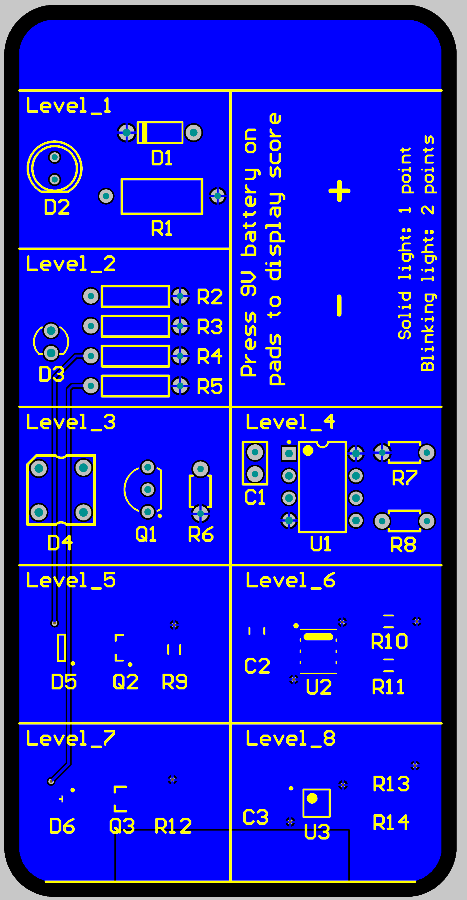

# solder-challenge
GBR files for open-source solder challenge, designed by Rick Pannen and used by ENGR100-980. [View Rick's work](https://workspace.circuitmaker.com/Projects/Details/Rick-Pannen/Soldering-Challenge#sectionDesignFiles)

To make it easier to visualize pad connections and troubleshoot issues, here are the top and bottom layers and their traces:

Top:

Bottom:

